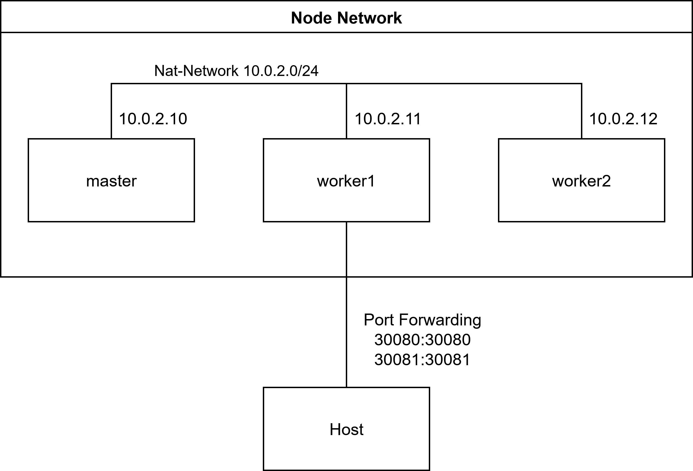
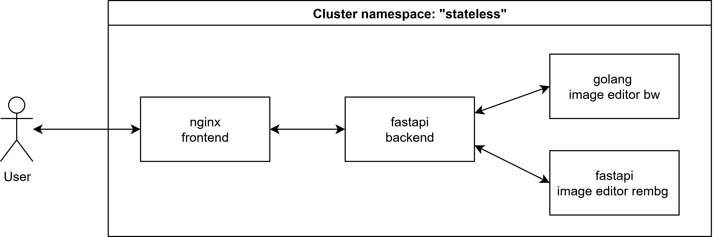
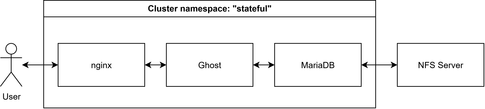

# Kubernetes Cluster Setup and Application Deployment

## Overview
This project demonstrates the setup and operation of a Kubernetes cluster that hosts both stateless and stateful applications.

The entire project report (in German) is available at [Projektbericht.pdf](Projektbericht.pdf).

The [Installation Guide](installation.md) covers the entire VM setup, install process and configuration of all components. It provides detailed instructions for setting up the master node, worker nodes, NFS server, and deploying both stateless and stateful applications in Kubernetes.

## Technologies Used
- VirtualBox for VM infrastructure
- Kubernetes (kubeadm, kubectl, kubelet) for the cluster
- Calico for pod networking
- Docker (with cri-dockerd) for container management
- NFS for persistent storage
- FastAPI, Nginx, Ghost CMS, MariaDB as services

## Setup 
Three VirtualBox VMs (1 master, 2 workers) running Ubuntu Server 24.04 form the Kubernetes cluster with NAT networking and shared folders for image transfer.

The Kubernetes cluster was initialized with kubeadm, using Calico for pod networking, a local Docker registry, and NFS for persistent volume storage, with multiple deployments managed across stateless and stateful namespaces.

## Stateless Application
The stateless application is a basic, modular image-processing web app consisting of a frontend (Nginx), backend (FastAPI), and two microservices for black-and-white conversion (Go) and background removal (Python/rembg), all deployed in Kubernetes with auto-scaling based on CPU utilization.

The stateless application implements RBAC to enforce fine-grained permissions. Two main roles, Developer (with full resource management except Secrets) and Viewer (read-only access), are defined using Kubernetes Roles and SSL certificates to securely control user access within the cluster.

## Stateless Application
The stateful application is a Ghost CMS deployed with a MariaDB database and Nginx reverse proxy, using Kubernetes StatefulSets and Persistent Volumes via NFS to ensure data persistence and consistent service identity.

